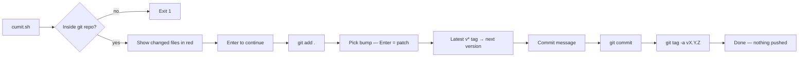

# GitCumIt

> A release helper that stages, commits and tags a semver bump read from your last git tag — and never pushes.


## Install

```bash
git clone <your-remote> && cd ArchUtils/GitCumIt
chmod +x cumit.sh
ln -s "$PWD/cumit.sh" ~/.local/bin/cumit     # optional: put it on PATH
```

Needs `bash` and `git`. Nothing else — no config file, no environment variables.

## Usage

```bash
cd your-repo
cumit.sh
```

```
Changed files (will be staged):
 M src/app.py
?? src/new.py

What kind of release is this?
  1) patch  (bug fixes)       [default — just press Enter]
  2) minor  (new features)
  3) major  (breaking changes)
Bump type [Enter=patch]: ⏎
Enter commit message: fix: handle empty response
✓ Done! Tagged v1.4.2
```

## API Reference

| Input | Accepts | Default | Effect |
|-------|---------|---------|--------|
| Enter at the preview | — | — | Runs `git add .` and stages everything shown |
| Bump type | `Enter` \| `1` \| `2` \| `3` | patch | Increments that segment, resets every segment below it |
| Commit message | any non-empty string | — | Used for both the commit and the annotated tag |

Produces one commit and one annotated tag `vX.Y.Z`. Pushes nothing.

## Features

- **Tag-driven versioning** — the next version is computed from the newest `v[0-9]*` tag, sorted by version, so git history is the only version store.
- **Semver reset rules** — a minor bump zeroes the patch, a major bump zeroes both. No manual arithmetic.
- **Safe cold start** — a repo with no tags yet starts from `v0.0.0`.
- **Preview before staging** — `git status --short` with forced color shows exactly what is about to be committed, then one Enter proceeds.
- **Never pushes** — the remote is your decision, every time.
- **Empty-tree tolerant** — a clean working tree still commits via `--allow-empty` instead of prompting.
- **Message required** — refuses to commit a blank message.
- **Loud, early failure** — `set -euo pipefail` and a hard exit outside a git repository.

## Configuration

| Option | Type | Default | Description |
|--------|------|---------|-------------|
| — | — | — | Zero-config; every choice is made interactively |

## Environment Variables

None.

## Development

```bash
bash -n cumit.sh                 # syntax check
git init /tmp/cumtest && cd /tmp/cumtest && cumit.sh   # safe sandbox
```

Single script, ~110 lines. The version math is the only logic worth testing — extract it and it becomes trivial to assert (`v1.4.2` + minor → `v1.5.0`, + major → `v2.0.0`).

## Architecture



Pre-flight check → preview → stage → compute → commit → tag. Key decisions: read the version from tags rather than a file so it can't drift; reset lower segments automatically; stop short of the push unconditionally.

## Contributing

PRs welcome. Open an issue first for major changes.
