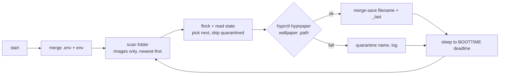

# Jackdaw

> Zero-dependency wallpaper rotation for Hyprland — one folder per profile, driven over IPC, survives restarts, suspend, and broken images.


Jackdaw watches a folder per profile (`~/Pictures/wallpapers/<profile>/`) and keeps the monitor wallpapered by telling **hyprpaper** what to show. It can run as a cycling daemon, as a one-shot behind a keybinding, or both at once. The state file remembers what was on screen, so your wallpaper survives a reboot — no black boot screen, no re-picking.

## Requirements

Python 3 (stdlib only — no deps, and that's a rule), plus [hyprpaper](https://github.com/hyprwm/hyprpaper) running under a live Hyprland session:

```bash
sudo pacman -S hyprpaper
```

Wallpapers are applied with `hyprctl hyprpaper wallpaper`, because hyprpaper ≥ 0.8 speaks a binary IPC protocol and hyprctl is its supported CLI.

## Install

```bash
cd ArchUtils/Jackdaw
cp .env.example .env    # set WALLPAPERS_ROOT if the default isn't right
mkdir -p ~/Pictures/wallpapers/<profile>   # drop images in; subfolders = profiles
python3 Jackdaw.py <profile> --once        # first wallpaper applied
```

## Usage

```bash
python3 Jackdaw.py <profile>              # daemon: cycle every DELAY_SECONDS
python3 Jackdaw.py work --once            # apply NEXT wallpaper and exit
python3 Jackdaw.py work --set dunes.jpg   # apply one specific image and exit
python3 Jackdaw.py work --restore         # re-apply CURRENT wallpaper (no rotation)
python3 Jackdaw.py --restore              # same, for the last-used profile
python3 Jackdaw.py work --status          # current/next wallpaper + effective config
python3 Jackdaw.py work --list            # rotation order, newest first
```

| Command | advances rotation? | needs hyprpaper? | purpose |
|---------|:---:|:---:|---------|
| daemon | every `DELAY_SECONDS` | yes (at start) | set-it-and-forget-it rotation |
| `--once` | one step per call | yes | keybinding / cron use; skips broken images |
| `--set FILE` | no — pins FILE | yes | "use exactly this one"; rejects paths outside the profile folder |
| `--restore [auto-profile]` | no | yes (waits up to 20 s) | boot-time repaint, see Integration |
| `--status` / `--list` | — | no | inspection |

Exit codes: `0` success, `1` validation/apply failure, `2` bad arguments. One-shots are safe alongside a live daemon — state writes go through `flock`.

Daemonizing is optional and per-profile:

```ini
# ~/.config/systemd/user/jackdaw@.service
[Service]
ExecStart=/usr/bin/python3 /path/to/Jackdaw/Jackdaw.py %i
Restart=on-failure

[Install]
WantedBy=default.target
```

```bash
systemctl --user enable --now jackdaw@work
```

## Hyprland integration

Jackdaw only applies wallpapers over IPC — hyprpaper itself starts with an **empty** background by design (no static `wallpaper =` lines in `hyprpaper.conf`). Four small pieces make that feel native.

**1. Autostart + boot repaint.** Without the restore line, boot = black screen until you touch a hotkey, because nothing re-applies the last wallpaper:

```lua
hl.exec_cmd("hyprpaper")
hl.exec_cmd("~/.config/hypr/scripts/jackdaw-restore.sh") -- Jackdaw.py --restore
```

The wrapper is silent on success and only pops a `hyprctl notify 3` failure toast — same contract as `jackdaw-next.sh` below. `--restore` polls for hyprpaper's IPC socket instead of failing fast, so racing autostart is fine.

**2. Manual switches.** One bind per profile, each advancing its rotation exactly once:

```lua
local jackdawNext = "~/.config/hypr/scripts/jackdaw-next.sh"
hl.bind("CTRL + ALT + 5", hl.dsp.exec_cmd(jackdawNext .. " asrar"))
```

**3. Hide the switch gap.** hyprpaper destroys its layer surface and builds a new one on every IPC switch (no transition support in 0.8 — upstream issue #371). For a frame or two Hyprland's *default background* shows through: the random logo, the splash text, `background_color`. Neutralize all three:

```lua
hl.config({ misc = {
    disable_hyprland_logo    = true,
    disable_splash_rendering = true,
    background_color         = "rgb(000000)",
} })
```

Black-on-black swap → imperceptible. Note hyprpaper paints its *own* splash inside the wallpaper surface too — kill it with `splash = 0` in hyprpaper.conf.

**4. No layer slide.** The fresh wallpaper layer otherwise plays `layersIn` (~0.4 s), reading as a slow black flash. Pin it instant, hyprpaper only — bars and toasts keep their animations:

```lua
hl.layer_rule({
    name    = "jackdaw-instant-wallpaper",
    match   = { namespace = "^hyprpaper$" },
    no_anim = true,
})
```

## Configuration

`.env` next to the script (real env vars win):

| Option | Type | Default | Description |
|--------|------|---------|-------------|
| `WALLPAPERS_ROOT` | path | `~/Pictures/wallpapers` | Root folder; one subfolder per profile |
| `DB_PATH` | path | `./wallpaper.json` | State file; relative paths resolve next to the script |
| `DELAY_SECONDS` | int | `3600` | Seconds between changes (daemon mode) |
| `RESTORE_WAIT_SECONDS` | int | `20` | How long `--restore` waits for hyprpaper's IPC socket |
| `IMAGE_EXTENSIONS` | csv | `.png,.jpg,.jpeg,.webp,.jxl` | What counts as a wallpaper |

**Extensions are a loaded gun.** The list must contain only formats hyprpaper's loader (`hyprgraphics`) can decode. This repo's build has **no HEIF/AVIF**, and gif/tiff/bmp fail too — and a failed decode is silent: hyprctl answers "ok", the monitor goes black. New downloads join the rotation live; the folder is re-scanned every cycle.

State file (`wallpaper.json`, git-ignored):

```json
{ "work": "dunes.jpg", "gaming": "neon-city.png", "_last": "work" }
```

Per-profile keys hold the *filename* currently on screen for that profile (never an index — re-sorting or pruning a folder can't corrupt rotation). `_last` records the most recently applied profile so a bare `--restore` at boot knows whose wallpaper to repaint; if it's missing (state files predating the feature), restore falls back to the first known profile and self-heals from there.

## How it works



Single file, deliberately: config merged at import, state written atomically (`mkstemp` + `os.replace`) under an exclusive `flock`, rotation as pure scan → pick → apply. Decisions worth keeping:

- **Filenames, not indexes** — survives folder edits; a vanished wallpaper falls back to newest.
- **hyprctl exit code is the only IPC truth** — parse nothing else from hyprpaper 0.8.
- **Empty monitor field** in `hyprctl hyprpaper wallpaper ,<path>` means "all monitors" (`*` is rejected by 0.8.4's validator).
- **`CLOCK_BOOTTIME` scheduling** — a laptop suspended mid-interval catches up on resume instead of drifting; suspend never eats a wallpaper slot or skips one.
- **A cycle must never raise** — deleted files, unreadable folders, failing IPC: logged, skipped, quarantined so one broken image can't livelock rotation or kill the daemon.

## Development

```bash
python3 -m py_compile Jackdaw.py       # syntax check
python3 Jackdaw.py <profile> --status  # sanity-check config resolution
```

No build, no tests yet — `last_index`, `scan_wallpapers`, and `load_env_file` are good first `pytest` targets. When testing anything that *applies*: point `WALLPAPERS_ROOT`/`DB_PATH` at a temp dir, and remember a login shell has `HYPRLAND_INSTANCE_SIGNATURE` set — one-shot commands will repaint the **real** monitor unless you unset it.

## Contributing

PRs welcome. Open an issue first for major changes. Keep the stdlib-only promise.
