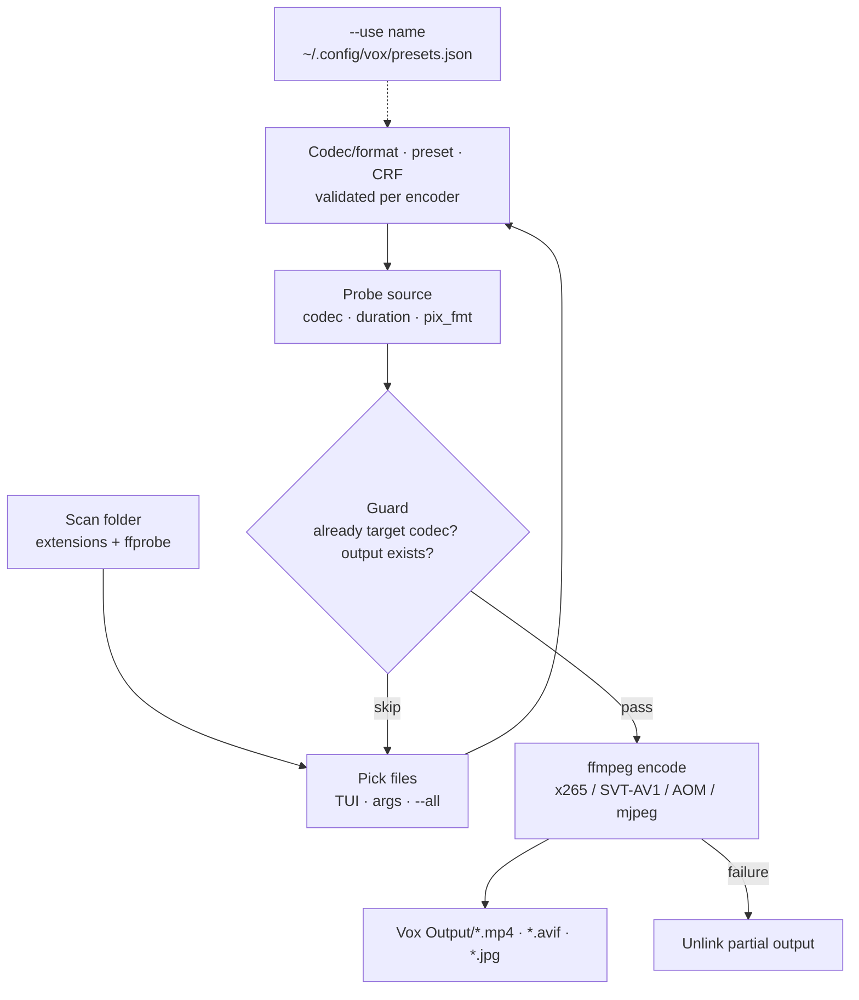

# Vox

> Convert videos to HEVC (H.265) or AV1, and images to AVIF or JPEG, with ffmpeg — in the folder you're already standing in.


## Install

```bash
git clone <your-remote> && cd ArchUtils/Vox
```

Python 3.8+, stdlib only — nothing to `pip install`. The one external requirement is `ffmpeg` + `ffprobe` on `PATH`:

```bash
ffmpeg -encoders | grep -E 'x265|svt|aom'   # check what your build supports
```

HEVC needs `libx265`; AV1/AVIF need `libsvtav1` or `libaom-av1`, plus the AVIF muxer for images. Vox probes all of this at startup and refuses with install hints rather than crashing mid-batch.

## Usage

```bash
python3 vox.py                                      # interactive TUI
python3 vox.py --all --codec hevc                   # every video → HEVC, no prompts
python3 vox.py movie.mkv --codec av1 --preset 8 --crf 30
python3 vox.py --all --images --crf 34              # every image → AVIF
python3 vox.py --all --images --format jpeg --crf 3 # every image → JPEG
python3 vox.py clip.mp4 --copy-audio --force        # keep original audio, overwrite output

python3 vox.py mk web                               # build a global named preset
python3 vox.py --use web                            # convert the whole folder with it
python3 vox.py ls                                   # list global presets
python3 vox.py rm web                               # delete one
```

Results always land in a `Vox Output/` subfolder. Originals are never modified.

## API Reference

| Flag | Type | Default | Description |
|------|------|---------|-------------|
| `files` | positional | interactive | Specific files to convert |
| `--codec` | `hevc` \| `av1` | asks | Target video codec |
| `--preset` | str \| int | `medium` / `8` | x265 name (`ultrafast`→`veryslow`) or AV1 number (SVT 0–13, AOM 0–11) |
| `--crf` | int | HEVC `24`, AV1/AVIF `30` | Quality — lower is better and bigger; clamped per codec |
| `--all` | flag | — | Convert every matching file in the folder without asking |
| `--images` | flag | — | Compress images instead of videos |
| `--format` | `avif` \| `jpeg` | asks (AVIF if available) | Image output format |
| `--force` | flag | — | Overwrite files already present in `Vox Output` |
| `--copy-audio` | flag | — | Stream-copy audio instead of re-encoding to AAC |
| `--use` | `NAME` | — | Apply a saved preset to the whole folder |
| `mk` | subcommand | — | Interactively create/update a preset (`mk [name]`) |
| `ls` | subcommand | — | List global presets |
| `rm` | subcommand | — | Delete a global preset (`rm <name>`) |

## Presets

A preset bundles the target and quality settings you use often, stored **globally** as `~/.config/vox/presets.json` (or `$XDG_CONFIG_HOME/vox/presets.json`) — so it works from any folder and never clutters your media directories.

```bash
python3 vox.py mk web          # answer a few prompts, saved as "web"
python3 vox.py --use web       # convert every video/image here with it
python3 vox.py ls              # web  video-av1 (preset=8, CRF=30)
python3 vox.py rm web
```

A preset stores the target (`video-hevc`, `video-av1`, `image-avif`, `image-jpeg`), the encoder preset, the CRF/quality value, and optionally `copy_audio` / `force`. It never stores file lists — `--use` always processes the whole folder.

Explicit command-line flags always win over the preset, so `vox --use web --crf 34` uses the preset's codec/preset but your CRF. The file is plain JSON and safe to hand-edit; unknown keys and invalid targets are warned about and skipped rather than crashing a run.

```json
{
  "web":   { "target": "video-av1",  "preset": "8", "crf": 30 },
  "thumbs":{ "target": "image-jpeg", "crf": 4, "force": true }
}
```

## Features

- **Batch video conversion** — discovers videos by extension and confirms with ffprobe, then converts the whole selection in one run.
- **HEVC and AV1** — roughly 50% smaller than H.264 for HEVC; AV1 compresses further for newer players.
- **Image → AVIF or JPEG** — PNG, JPG, BMP, TIFF and WebP. AVIF (AV1 still-image) gives the best ratio; JPEG uses ffmpeg's built-in `mjpeg` encoder and works on every build, quality set with `-q:v` (2–31).
- **One quality dialect** — x265 named presets, SVT-AV1 integers and AOM `cpu-used` values are all normalized to the same two prompts, with per-encoder range validation.
- **Runtime capability detection** — queries `ffmpeg -encoders` / `-muxers` at startup, prefers SVT-AV1 over the far slower libaom, and only offers what can actually run.
- **Loss-prevention guards** — skips sources already in the target codec and outputs that already exist, unless `--force`.
- **Transparency flattening** — the AVIF muxer can't store alpha, so transparent images are composited onto white instead of encoding as garbage.
- **Clean failure semantics** — a partial output is unlinked on any non-ok status, so `Vox Output` never accumulates corrupt files.
- **Named presets** — `vox mk` saves a reusable target+quality bundle to the global `~/.config/vox/presets.json`; `vox --use <name>` runs it over the folder, and CLI flags override individual fields.
- **Full-screen TUI** — arrow-key wizard (mode → files → codec/format → preset → CRF) with live per-file progress from ffmpeg's `-progress pipe:1`.
- **Interrupt-safe** — Ctrl-C terminates ffmpeg, cleans up and stops the batch, leaving a countable state.

## Configuration

| Option | Type | Default | Description |
|--------|------|---------|-------------|
| Output folder | path | `./Vox Output` | Created next to the source folder |
| HEVC preset | str | `medium` | x265 speed/quality trade-off |
| HEVC CRF | int | `24` | 0–51 |
| AV1 preset | int | `8` (SVT) / `6` (AOM) | 0–13 / 0–11 |
| AV1 + AVIF CRF | int | `30` | 0–63 |
| JPEG quality (`-q:v`) | int | `3` | 2–31 (lower = better) |
| Preset file | path | `~/.config/vox/presets.json` | Global named presets (`vox mk`) |

## Environment Variables

None. The only state is the optional global `~/.config/vox/presets.json` written by `vox mk`; delete it and Vox is back to pure flags-and-prompts. A legacy per-folder `.vox.json` is still read once if no global file exists, to ease migration.

## Development

```bash
python3 -m py_compile vox.py                    # syntax check
python3 vox.py tiny.mp4 --codec hevc --preset ultrafast --crf 40   # fast end-to-end run
```

Single file, stdlib only — keep it that way. `validate_preset`, the CRF clamps, `apply_preset` (CLI-over-preset precedence) and the encoder-preference logic are pure and are the natural first `pytest` targets.

## Architecture



Startup probes encoder and muxer availability, then each file goes scan → guard → probe → encode → verify. A saved preset (`vox mk`, dashed edge) feeds straight into the settings stage, with explicit CLI flags taking precedence. Key decisions: never write in place, so originals are untouchable by construction; ask ffmpeg what it can do instead of assuming a build; flatten alpha rather than emit corrupt AVIF/JPEG; delete partials on failure; keep preset state global in `~/.config/vox/presets.json`.

## Contributing

PRs welcome. Open an issue first for major changes.
